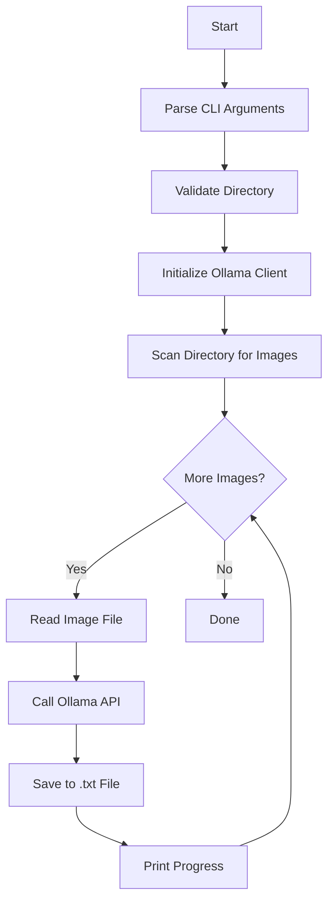

# ClassiGo Image Classifier Project

## Overview

Create a Go application that reads all images from a specified directory, sends them to Ollama's glm4-v-flash model for description generation, and saves the descriptions to corresponding text files.

## Project Structure

```
ClassiGo/
├── go.mod
├── go.sum
├── main.go
└── README.md
```

## Implementation Steps

### 1. Initialize Go Module

- Create `go.mod` with module name `github.com/dan/classigo` (or appropriate name)
- Add dependency: `github.com/ollama/ollama v0.1.0` (latest version)

### 2. Create Main Application ([main.go](main.go))

**Core functionality:**

- Accept directory path as command-line argument (default: current directory)
- Scan directory for image files (`.jpg`, `.jpeg`, `.png`, `.gif`, `.bmp`, `.webp`)
- For each image:
  - Read file contents
  - Send to Ollama API with model `glm4-v-flash`
  - Prompt: "Напиши от 10 до 30 слов описывающих изображение"
  - Save response to `.txt` file (e.g., `image.jpg` → `image.txt`)
  - Display progress in console

**Error handling:**

- Validate directory exists and is readable
- Check if Ollama client is accessible
- Handle file read/write errors gracefully
- Skip non-image files
- Continue processing on individual file errors with logging

**Key improvements over sample code:**

- Proper error checking (no ignored errors with `_`)
- Directory scanning logic
- File extension filtering
- Output file creation with proper naming
- Progress indicators and informative messages

### 3. Create Documentation ([README.md](README.md))

Include:

- Project description
- Prerequisites (Ollama installation, glm4-v-flash model)
- Installation instructions
- Usage examples
- Configuration options

## Technical Details

**Dependencies:**

- `github.com/ollama/ollama/api` - Ollama API client
- Standard library: `os`, `path/filepath`, `context`, `fmt`, `strings`

**Workflow:**



**Error Handling Strategy:**

- Fatal errors: directory not found, Ollama client unavailable
- Non-fatal errors: individual file read/write failures (log and continue)

## Expected Output

For each image file, the application will:

1. Print: `Processing: image.jpg...`
2. Call Ollama API
3. Save description to `image.txt`
4. Print: `Saved: image.txt`
